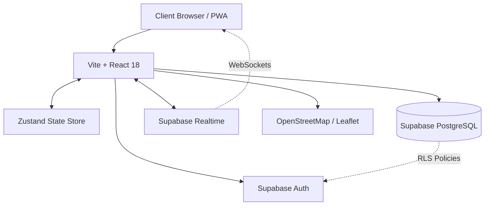

<div align="center">
  

  **Makan enak, porsi kuli, dompet tetap aman sampai akhir bulan.** 🍜💸

  [](https://reactjs.org/)
  [](https://www.typescriptlang.org/)
  [](https://tailwindcss.com/)
  [](https://supabase.com/)
  [](https://www.framer.com/motion/)
  [](https://vitejs.dev/)

  *Dirancang, dibangun, dan dikembangkan sepenuhnya oleh **Lanciuy**, Lead Developer & Creator.*
</div>

---

## 📑 Daftar Isi
- [📖 Tentang Proyek Ini](#-tentang-proyek-ini)
- [✨ Fitur Eksekutif](#-fitur-eksekutif)
- [🏗️ Arsitektur Sistem](#-arsitektur-sistem)
- [💻 Tech Stack](#-tech-stack)
- [📸 Pratinjau UI/UX](#-pratinjau-uiux)
- [🚀 Panduan Instalasi (Development)](#-panduan-instalasi-development)
- [📂 Struktur Proyek](#-struktur-proyek)
- [👑 Epilog Kreator](#-epilog-kreator)

---

## 📖 Tentang Proyek Ini

**NAKAM** bukanlah sekadar direktori kuliner biasa. Ini adalah **ekosistem hibrida kelas enterprise** yang menggabungkan fitur pencarian makanan berbasis geolokasi dengan kapabilitas pelacakan keuangan setara aplikasi *Financial Technology (FinTech)*. 

Diciptakan oleh **Lanciuy** untuk memecahkan dilema absolut setiap mahasiswa. Dengan Nakam, pengguna dapat berburu *hidden gems* (warung murah) di sekitar radius kampus, memonitor metrik pengeluaran bulanan, dan bereaksi terhadap *Flash Promo* secara *real-time*—semua dibalut dalam antarmuka *premium glassmorphism* yang memanjakan mata.

---

## ✨ Fitur Eksekutif

Nakam dirancang untuk melayani 3 entitas utama: **Mahasiswa (Consumer)**, **Pemilik Warung (Merchant)**, dan **Administrator**.

### ⚡ 1. Real-Time WebSocket Synchronization
Memanfaatkan kapabilitas **Supabase Realtime Channels**, NAKAM mengeliminasi kebutuhan *page refresh*.
- **Admin Broadcast**: Pengumuman global yang disiarkan instan ke seluruh *device* yang sedang *online*.
- **Merchant Flash Promo**: Pemilik warung dapat memicu *Flash Promo* berbatas waktu, menciptakan FOMO (*Fear of Missing Out*) instan di panel notifikasi pengguna terdekat.

### 🗺️ 2. Spatial Mapping & Proximity Engine
Terintegrasi secara *native* dengan **OpenStreetMap** dan **Leaflet.js**, memanfaatkan *Geolocation API* modern.
- Sistem secara matematis memetakan dan mengalkulasi jarak absolut (meter/kilometer) antara koordinat mahasiswa dengan titik *merchant*. Memastikan rekomendasi 100% *walkable* atau *drivable*.

### 💳 3. FinTech-Grade Budgeting System
Lebih dari sekadar aplikasi makanan, Nakam bertindak sebagai *financial advisor* saku Anda.
- **Smart Wallet & E-Receipt**: Pencatatan otomatis untuk setiap *check-in* atau transaksi dalam format Resi Elektronik realistis.
- **Dynamic Limit Warning**: Visualisasi limit anggaran bulanan yang reaktif. UI akan beradaptasi secara dinamis (Hijau -> Kuning -> Merah) ketika metrik pengeluaran menyentuh ambang batas kritis.

### 💎 4. Hyper-Premium UI/UX
Mengusung filosofi *form follows function* tanpa kompromi estetika:
- **Glassmorphism Design Language**: Efek translusen berpadu *Deep Dark Mode* yang elegan.
- **Spring-Physics Animation**: Transisi antar halaman dan interaksi elemen ditenagai oleh **Framer Motion** untuk sensasi *liquid* yang tak tertandingi.

---

## 🏗️ Arsitektur Sistem

Berikut adalah alur data tingkat tinggi (*High-Level Data Flow*) dari arsitektur NAKAM:



---

## 💻 Tech Stack

Kesempurnaan aplikasi ini ditopang oleh teknologi modern yang berfokus pada **performa, skalabilitas, dan keamanan**.

| Kategori | Teknologi | Kegunaan Utama |
| :--- | :--- | :--- |
| **Frontend Core** | React 18, TypeScript, Vite | *Rendering* super cepat dengan keandalan *type-safety* ekstrem. |
| **Styling & Motion**| Tailwind CSS, Framer Motion | Eksekusi UI *pixel-perfect* dan animasi *physics-based*. |
| **Backend & BaaS** | Supabase (PostgreSQL) | Manajemen *Database*, Autentikasi, RLS, & *WebSocket Broadcast*. |
| **State Management**| Zustand | Penyimpanan *state* global *zero-boilerplate*, menjaga data dompet *real-time*. |
| **Geospatial & UI** | React Leaflet, Lucide React| *Rendering* peta spasial dan ikonografi tajam serta konsisten. |

---

## 📸 Showcase UI/UX (Interactive Live Demo)

*Berikut adalah rekaman langsung pengalaman antarmuka NAKAM yang dirancang presisi hingga ke level piksel, menggabungkan fungsionalitas ekstrem dengan estetika kelas dunia.*

<div align="center">
  
</div>

<br/>

<table align="center" style="border-collapse: collapse; border: none;">
  <tr>
    <td align="center" width="50%" style="border: none; padding: 15px;">
      <h3>💳 Smart Wallet & Flash Promo</h3>
      <p>Pemantauan anggaran <i>real-time</i> dan notifikasi promo FOMO instan untuk mahasiswa.</p>
    </td>
    <td align="center" width="50%" style="border: none; padding: 15px;">
      <h3>🗺️ Proximity Radar</h3>
      <p>Pemetaan spasial akurat dengan Leaflet untuk kalkulasi jarak warung absolut.</p>
    </td>
  </tr>
  <tr>
    <td align="center" width="50%" style="border: none; padding: 15px;">
      <h3>🧾 Auto E-Receipt</h3>
      <p>Rekapitulasi riwayat transaksi hiper-realistis setara aplikasi perbankan modern.</p>
    </td>
    <td align="center" width="50%" style="border: none; padding: 15px;">
      <h3>💎 Premium Glassmorphism</h3>
      <p>Estetika <i>translucency</i> pekat, <i>dark mode</i> absolut, dan efek <i>blur</i> yang elegan.</p>
    </td>
  </tr>
</table>

> 💡 **PRO TIP:** *Pindahkan file video `.webp` dari folder lokal ke dalam folder `docs/` di dalam repositori Anda dan ubah *path* `src` di atas menjadi relatif (`docs/nakam_showcase.webp`) sebelum melakukan *push* ke GitHub.*

---

## 🚀 Panduan Instalasi (Development)

Tertarik untuk menjalankan atau membedah kode sumber NAKAM di mesin lokal Anda? Ikuti instruksi komprehensif berikut:

### Prasyarat
- [Node.js](https://nodejs.org/) (Versi 18 atau lebih baru)
- Git

### Langkah-langkah
1. **Kloning Repositori**
   ```bash
   git clone https://github.com/Lanciuy/NAKAM.git
   cd NAKAM
   ```

2. **Instalasi Dependensi**
   ```bash
   npm install
   ```

3. **Konfigurasi Variabel Lingkungan**
   Buat file `.env.local` pada *root directory* dan sesuaikan kredensial Supabase Anda (Atau hubungi **Lanciuy** untuk *dev keys*):
   ```env
   VITE_SUPABASE_URL=your_supabase_url
   VITE_SUPABASE_ANON_KEY=your_supabase_anon_key
   ```

4. **Inisiasi Development Server**
   ```bash
   npm run dev
   ```
   *Buka `http://localhost:5173` di peramban Anda.*

---

## 📂 Struktur Proyek

```text
📦 NAKAM
 ┣ 📂 src
 ┃ ┣ 📂 components      # Komponen UI Reusable (BottomNavBar, Cards, dll)
 ┃ ┣ 📂 pages           # Halaman Utama (Home, Profile, RestaurantsTab, dll)
 ┃ ┣ 📂 store           # Zustand State Management (store.tsx)
 ┃ ┣ 📂 lib             # Konfigurasi eksternal (Supabase client)
 ┃ ┣ 📜 App.tsx         # Routing & Main Layout
 ┃ ┗ 📜 index.css       # Tailwind entry point
 ┣ 📜 .env.local        # Environment Variables (Ignored in Git)
 ┣ 📜 package.json      # Konfigurasi dependensi npm
 ┗ 📜 README.md         # Dokumentasi Utama
```

---

## 👑 Epilog Kreator

> *"Kode yang baik adalah kode yang bekerja. Namun kode yang luar biasa adalah kode yang tidak hanya bekerja, tetapi juga menyelesaikan masalah nyata dengan keindahan visual yang memanjakan mata."* 
> 
> **— Lanciuy, Pembuat & Pengembang Utama NAKAM**

Terima kasih telah mengunjungi repositori NAKAM! Proyek ini adalah wujud nyata bagaimana *engineering* yang solid dan antarmuka kelas dunia dapat disatukan untuk memberdayakan UMKM (pemilik warung) sekaligus menyelamatkan dompet mahasiswa.

Beri dukungan dengan menekan tombol ⭐ **Star** di pojok kanan atas halaman repositori ini. Mari berinovasi tanpa batas! 🚀